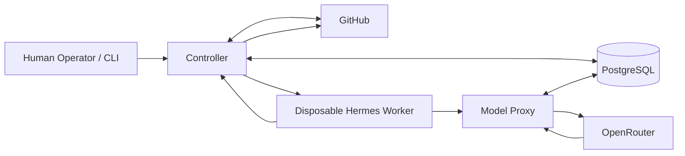
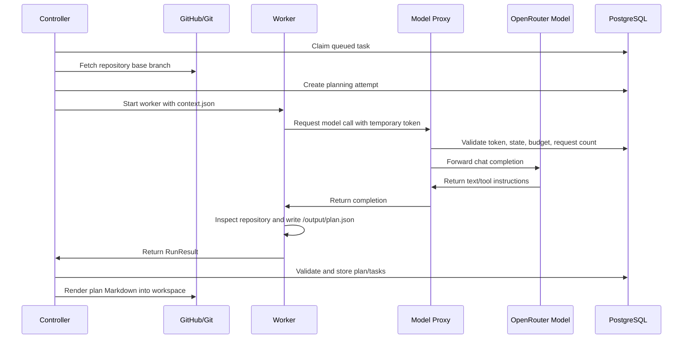
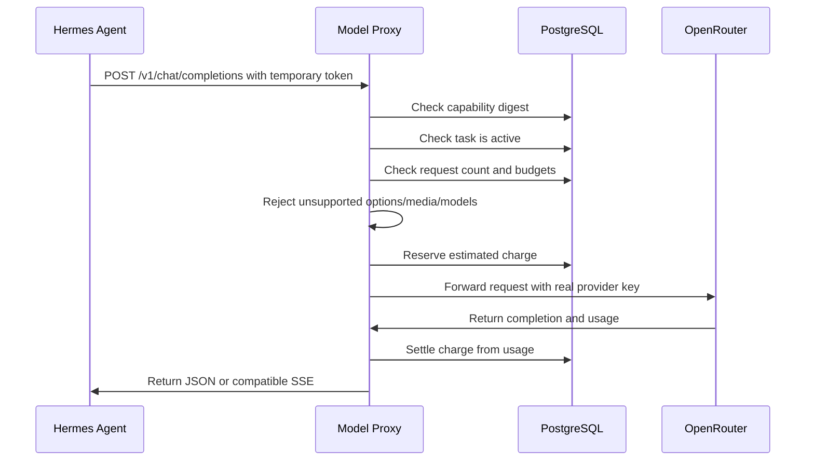

# Hermes Autocoder: Project Details and Data Flow

This document explains the Hermes Autocoder project in `/home/cryptic/Project/Hermes` as it is currently structured. It covers the goal of the project, the technologies it uses, how the main services cooperate, the execution workflow, and how data moves through the system.

No API keys, GitHub tokens, or private secrets are included here.

## 1. Main Goal

Hermes Autocoder is an autonomous GitHub maintenance service.

The goal is to let an AI coding agent safely perform repository maintenance work while keeping the human operator in control of the final merge. The system can discover repositories, accept a specific goal, plan the work, run Hermes Agent inside an isolated Docker worker, validate the changes, write human-readable reports, and open GitHub pull requests.

The project does not auto-merge pull requests. A human reviews and merges them.

The core idea is:

1. The controller decides what work is allowed.
2. The worker edits one isolated checkout.
3. The model proxy controls every model request.
4. PostgreSQL stores the authoritative state.
5. GitHub receives only reviewed branches and pull requests.

## 2. What We Use

| Area | Technology | Why it is used |
| --- | --- | --- |
| AI agent runtime | NousResearch Hermes Agent | Performs tool-using coding work inside the worker container |
| Model provider | OpenRouter | Provides a Chat Completions-compatible hosted model endpoint |
| Current model | `nvidia/nemotron-3-super-120b-a12b:free` | Tested free OpenRouter model for this setup |
| Backend language | Python 3 | Controller, CLI, proxy, database models, and worker orchestration |
| API framework | FastAPI | Runs the internal model proxy |
| Database | PostgreSQL 16 | Stores repositories, tasks, attempts, capabilities, charges, leases, and events |
| ORM | SQLAlchemy | Defines and queries persistent database tables |
| Validation | Pydantic | Validates config, task contracts, plans, reviews, and run results |
| Containers | Docker and Docker Compose | Runs persistent services and disposable worker containers |
| Git hosting | GitHub | Source repositories, branches, pull requests, checks, and review feedback |
| Dependency tool | uv | Local Python development and test environment |
| Testing | pytest and ruff | Automated tests and static checks for the Autocoder codebase |

The Compose deployment runs three persistent services:

| Service | Purpose |
| --- | --- |
| `database` | PostgreSQL state store |
| `controller` | Scheduler, GitHub integration, Docker orchestration, validation, publication |
| `model-proxy` | Internal gateway between workers and OpenRouter |

The controller dynamically creates separate worker containers. Workers are not permanent Compose services.

## 3. Important Project Files

| Path | Purpose |
| --- | --- |
| [README.md](../README.md) | Short project introduction, components, and basic commands |
| [compose.yaml](../compose.yaml) | Persistent Docker services, networks, volumes, and secret wiring |
| [config.yaml](../config.yaml) | Local runtime configuration for model, repository, limits, and profiles |
| [config.example.yaml](../config.example.yaml) | Template for a clean deployment configuration |
| [Dockerfile](../Dockerfile) | Builds the controller and model-proxy image |
| [docker/worker.Dockerfile](../docker/worker.Dockerfile) | Builds the Hermes worker image |
| [src/autocoder/controller.py](../src/autocoder/controller.py) | Main scheduler and workflow engine |
| [src/autocoder/worker.py](../src/autocoder/worker.py) | Docker worker creation and command execution |
| [src/autocoder/hermes_runner.py](../src/autocoder/hermes_runner.py) | Adapter that runs Hermes Agent inside a worker |
| [src/autocoder/proxy.py](../src/autocoder/proxy.py) | Internal model proxy API |
| [src/autocoder/budget.py](../src/autocoder/budget.py) | Capability tokens, request limits, and budget accounting |
| [src/autocoder/models.py](../src/autocoder/models.py) | Database tables |
| [src/autocoder/contracts.py](../src/autocoder/contracts.py) | Worker input/output contracts |
| [src/autocoder/gitops.py](../src/autocoder/gitops.py) | Git clone, branch, commit, push, and file safety gates |
| [docs/DEPLOYMENT.md](DEPLOYMENT.md) | Deployment runbook |
| [docs/HERMES_WORKFLOW_STEP_BY_STEP.md](HERMES_WORKFLOW_STEP_BY_STEP.md) | Startup and execution guide |

## 4. Current Local Configuration

The current local setup uses OpenRouter through a `.env` file. Compose reads `OPENROUTER_API_KEY` from `.env` and exposes it as the Docker secret `/run/secrets/model_provider` inside the controller and model proxy.

Workers do not receive the real OpenRouter API key.

The current local `config.yaml` is configured with:

| Setting | Current value |
| --- | --- |
| Owner | `CrypticFate` |
| Pilot repository | `CrypticFate/demohermes` |
| Automatic enrollment | Disabled |
| Provider URL | `https://openrouter.ai/api/v1` |
| Model | `nvidia/nemotron-3-super-120b-a12b:free` |
| Input price | `0` USD per million tokens |
| Output price | `0` USD per million tokens |
| Daily budget ceiling | `5.0` USD |
| Monthly budget ceiling | `20.0` USD |
| Max model requests per attempt | `25` |
| Max Hermes iterations | `15` |
| Task deadline | `900` seconds |
| Max attempts per task | `3` |
| Max open PRs per repository | `3` |
| Worker CPU | `2` |
| Worker memory | `3g` |
| Worker image | Pinned by image ID |

The budget ceilings are application-side controls. They are not the same thing as provider billing limits or OpenRouter quota limits.

## 5. High-Level Architecture



The controller is the trusted service. It has access to GitHub credentials, the database, the Docker socket, and persistent storage.

The worker is intentionally limited. It receives only a repository checkout, task input, writable output, and a temporary model token. It does not receive GitHub credentials, database credentials, the provider key, or the Docker socket.

The model proxy is the only service that can use the real provider key. Before forwarding a request to OpenRouter, it checks the temporary worker token, task state, model ID, request count, configured budgets, and request format.

## 6. Security Model

The project is designed around containment and human review.

Important security boundaries:

| Boundary | How it works |
| --- | --- |
| Provider key | Stored through Compose secret from `.env`; available only to controller/proxy |
| GitHub token | Stored in `secrets/`; used by controller for GitHub and Git operations |
| Worker model access | Worker gets a temporary capability token, not the provider key |
| Worker filesystem | Read-only root filesystem, writable workspace/output, read-only `.git` mount |
| Worker privileges | Non-root user, dropped Linux capabilities, no-new-privileges |
| Worker resources | CPU, memory, PID, tmpfs, workspace size, disk-free, and timeout limits |
| Git publication | Controller commits and pushes; worker is told not to commit, push, or create PRs |
| File safety | Git gate blocks protected paths, possible secrets, symlinks, binary files, oversized files, and path escapes |

This is a practical isolation layer for ordinary repository automation. It is not a sandbox for deliberately hostile code.

## 7. Persistent Data Model

PostgreSQL is the source of truth. Markdown files are human-readable projections.

Main database tables:

| Table | Stored data |
| --- | --- |
| `control` | Pause state, budget ceilings, heartbeat, discovery/poll timestamps, global lease |
| `repositories` | GitHub repositories, access/enabled flags, default branch, scan metadata, repository lease |
| `tasks` | Goals, plans, implementation tasks, state, branch, PR URL, acceptance criteria, feedback |
| `attempts` | One planning/implementation/review attempt, logs, checks, changed files, report path |
| `events` | State transitions and operational events |
| `capabilities` | Hashed temporary model tokens issued to workers |
| `charges` | Reserved/measured model request accounting |

Important task states:

```text
queued -> planning -> planned
ready -> running -> validating -> pr_open -> awaiting_review -> merged
```

Other possible states are `blocked`, `failed`, `cancelled`, and `closed_unmerged`.

`planned` means a goal was decomposed into executable tasks. It does not mean the code has been changed or merged.

## 8. Main Workflows

### 8.1 Initialization Workflow

1. Docker Compose starts PostgreSQL.
2. `autocoder init` applies database migrations and initializes control state.
3. The system starts paused by default.
4. `autocoder discover` records accessible GitHub repositories.
5. The controller and model proxy start as persistent services.
6. `autocoder doctor` checks configuration, secrets, Docker access, worker network, budgets, and pinned worker images.
7. The operator enables a repository and resumes the service.

Useful commands are documented in [docs/HERMES_WORKFLOW_STEP_BY_STEP.md](HERMES_WORKFLOW_STEP_BY_STEP.md).

### 8.2 Repository Discovery Workflow

The controller periodically lists repositories for each configured owner.

For each repository it records:

| Field | Meaning |
| --- | --- |
| Repository ID | Stable GitHub repository ID |
| Full name | `OWNER/REPOSITORY` |
| Default branch | Usually `main` |
| Accessibility | Whether the token can still access the repository |
| Enabled state | Whether the controller may work on it |
| Reason | Why it is disabled or inaccessible |

Repositories are rejected or disabled when they are archived, excluded forks, empty, missing push permission, explicitly excluded, or no longer accessible.

Automatic enrollment is currently disabled. The configured pilot repository and manually enabled repositories are eligible.

### 8.3 Goal Workflow

A human can add a goal:

```bash
docker compose exec controller autocoder -c /app/config.yaml goal add OWNER/REPO \
  "Objective text" \
  --acceptance "Acceptance criterion"
```

The goal becomes a queued planning task. Nothing is changed in GitHub at this point.

The controller later claims the queued goal, prepares a checkout, starts a worker, and asks Hermes to produce a structured plan.

### 8.4 Maintenance Scan Workflow

When resumed, the controller can also create automatic maintenance scan tasks for enabled repositories.

A scan is skipped when:

| Skip condition | Reason |
| --- | --- |
| Repository has pending work | Avoids overlapping plans |
| Repository has too many open PRs | Respects `max_open_prs` |
| Scan interval has not elapsed | Avoids repeated analysis |
| Repository base/context did not change | Avoids duplicate work |

Autonomous scans are instructed to propose only concrete maintenance work such as bugs, tests, documentation corrections, or CI fixes. They are not authorized to invent new product features.

### 8.5 Planning Workflow

Planning turns a goal or scan into executable tasks.



Hermes must write `/output/plan.json` matching the `PlanResult` schema. The plan can contain at most five tasks. Each task includes title, objective, evidence, acceptance criteria, category, and dependencies.

The application rejects duplicate task keys, missing dependencies, dependency cycles, and planner file changes.

### 8.6 Implementation Workflow

Implementation is the main coding path.

1. The controller claims a `ready` task.
2. It prepares or reuses a stable branch named `agent/<task-id>`.
3. It fetches the current default branch and records the base commit.
4. It selects a runtime profile.
5. It starts a pinned worker image.
6. It runs setup commands, if configured.
7. It runs baseline checks before the model changes files.
8. It asks Hermes to implement the task.
9. Hermes reads, edits, and tests files inside `/workspace`.
10. The controller runs the configured checks again.
11. Git safety gates inspect changed files.
12. A fresh Hermes review session evaluates the diff against acceptance criteria.
13. The controller verifies that review did not alter files.
14. The controller commits implementation and report files.
15. The controller pushes the branch and opens or updates a pull request.

The worker cannot push to GitHub. Only the controller performs commits, pushes, and PR operations.

### 8.7 Model Request Workflow



The proxy supports text and tool-style Chat Completions. It rejects unsupported request options, media content, alternate models, provider overrides, invalid output token limits, expired capability tokens, paused runs, inactive tasks, missing budgets, request limits, and oversized request bodies.

If the provider returns a `429`, the proxy performs one bounded retry when the provider gives a reasonable `Retry-After`. If the rate limit remains, it returns a rate-limit error to the worker.

### 8.8 Validation and Review Workflow

Validation uses both deterministic checks and model review.

| Validation layer | What it checks |
| --- | --- |
| Profile checks | Repository-specific commands such as tests, lint, build, or custom shell checks |
| Git gate | Protected paths, secret patterns, symlinks, binary files, large files, path escapes, excessive file count |
| No-empty-change gate | Blocks attempts that do not modify implementation files |
| Fresh review | Separate Hermes review of diff and acceptance criteria |
| Digest check | Confirms validation/review did not alter source after implementation |

The review result must mark every acceptance criterion as met and must not include objections. If checks pass but the review is incomplete, the PR can be published as a draft and repaired within the attempt limit.

### 8.9 Publication Workflow

Publication happens only after the controller has recorded the validated source commit and report commit.

1. Controller verifies the publication workspace matches the recorded commit.
2. Controller pushes only an `agent/...` branch.
3. Controller creates or updates a GitHub pull request.
4. PR body links the plan and report paths.
5. A passing local validation opens a ready PR.
6. Incomplete validation opens a draft PR.
7. A human reviews and merges.

The controller never merges a PR.

### 8.10 PR Polling and Repair Workflow

The controller polls open PRs.

It observes:

| Signal | Result |
| --- | --- |
| PR merged | Task becomes `merged`; repository becomes eligible for a new scan |
| PR closed without merge | Task becomes `closed_unmerged` |
| Maintainer feedback | Feedback is saved and task can return to `ready` |
| Failing CI checks | CI failure summary is saved and task can return to `ready` |
| Attempt limit reached | Task becomes `blocked` |

Repair attempts reuse the existing branch and include maintainer feedback and failing check information in the next implementation prompt.

### 8.11 Recovery Workflow

The controller is designed to recover from restarts.

On startup or each active tick it reconciles:

| Situation | Recovery behavior |
| --- | --- |
| Finished attempt still has a container ID | Removes abandoned worker containers |
| Attempt is `publication_pending` | Retries publication without rerunning the coding job |
| Attempt was interrupted | Revokes token, marks report, and requeues when attempt allowance remains |
| Budget was exhausted | Pauses/retries when the next budget period allows |

Repository and controller leases prevent two controllers from writing the same repository at the same time.

## 9. Data Flow

### 9.1 Configuration and Secrets Flow

```text
.env
  -> Compose environment
  -> Docker secret: model_provider
  -> /run/secrets/model_provider in controller and model-proxy
  -> model-proxy uses key only when forwarding to OpenRouter
```

```text
secrets/github_personal
  -> mounted into controller
  -> controller reads token for GitHub API and Git push
  -> worker never receives this token
```

```text
config.yaml
  -> mounted read-only into controller and model-proxy
  -> defines owners, model, limits, profiles, repositories, data_dir
```

### 9.2 Task Data Flow

```text
CLI or scan
  -> tasks table
  -> controller claim
  -> attempt row
  -> data/local/runs/<attempt-id>/input/context.json
  -> worker /input/context.json
  -> Hermes execution
  -> worker /output/result.json
  -> controller validates RunResult
  -> tasks/attempts/events tables
```

### 9.3 Repository Data Flow

```text
GitHub repository
  -> controller git fetch
  -> data/local/workspaces/<task-id>
  -> worker edits /workspace
  -> controller validates changed files
  -> controller commits
  -> controller pushes agent/<task-id>
  -> GitHub pull request
```

### 9.4 Model Data Flow

```text
Hermes Agent prompt/tool conversation
  -> model-proxy
  -> PostgreSQL capability and budget checks
  -> OpenRouter Chat Completions API
  -> model-proxy accounting
  -> Hermes Agent
  -> tool call execution in worker
  -> next model request
```

The model sees repository text, task instructions, tool outputs, baseline check results, and diffs. It does not receive GitHub tokens, database credentials, the provider API key, or the Docker socket.

### 9.5 Output Artifact Flow

```text
Plan result
  -> database tasks
  -> plan/<plan-id>/overview.md
  -> plan/<plan-id>/<sequence>-<task-id>.md
```

```text
Attempt result
  -> report/<task-id>/<attempt-id>.md
  -> PR body links report path
  -> local data directory keeps attempt report
```

Markdown artifacts help humans review what happened. The database remains the authoritative state store.

## 10. Runtime Profiles

Runtime profiles define how a repository is tested.

A profile contains:

| Field | Meaning |
| --- | --- |
| `image` | Pinned worker image ID or digest |
| `setup` | Commands to install dependencies |
| `checks` | Independent commands that must be run before and after implementation |
| `command_seconds` | Per-command timeout |

The current `CrypticFate/demohermes` profile uses a minimal check:

```text
test -f index.html && echo "index.html exists" || (echo "index.html missing" && exit 1)
```

That proves only that `index.html` exists. For stronger real work, repository profiles should run meaningful tests, builds, linters, type checks, or custom validation commands.

## 11. Budgets and Limits

Budget accounting is done by the model proxy.

Each model call:

1. Requires a valid temporary capability token.
2. Must match the configured model.
3. Must stay within `max_output_tokens`.
4. Must stay within `max_model_requests`.
5. Reserves an estimated charge.
6. Forwards the request to OpenRouter.
7. Settles the charge from provider usage if available.

For the current free OpenRouter model, configured input and output prices are zero, so successful measured charges settle to zero application cost. Request count limits and OpenRouter free-tier quotas still matter.

The daily and monthly budget ceilings are still required by the application because they are part of the controller's authorization model.

## 12. What Starts Work

Building Docker images does not start agent work.

Work starts only when all of these are true:

1. The database is initialized.
2. The controller and model proxy are running.
3. The service is resumed.
4. A repository is enabled and accessible.
5. Budgets are configured.
6. A queued goal or eligible scan exists.
7. The controller can claim the task.
8. A runtime profile with checks is available.
9. The worker image is pinned and runnable.
10. The model proxy accepts requests for the attempt.

## 13. Operational Commands

Typical commands:

```bash
docker compose up -d database
docker compose run --rm controller init
docker compose run --rm controller discover
docker compose up -d controller model-proxy
docker compose exec controller autocoder -c /app/config.yaml doctor
docker compose exec controller autocoder -c /app/config.yaml status
docker compose exec controller autocoder -c /app/config.yaml repos list
docker compose exec controller autocoder -c /app/config.yaml repos enable OWNER/REPO
docker compose exec controller autocoder -c /app/config.yaml goal add OWNER/REPO "Goal" --acceptance "Acceptance criterion"
docker compose exec controller autocoder -c /app/config.yaml resume
docker compose exec controller autocoder -c /app/config.yaml pause
docker compose exec controller autocoder -c /app/config.yaml report show TASK_ID
```

For day-to-day use, define:

```bash
hc() {
  docker compose exec controller autocoder -c /app/config.yaml "$@"
}
```

Then use:

```bash
hc status
hc repos list
hc repos enable CrypticFate/demohermes
hc goal add CrypticFate/demohermes "Goal" --acceptance "Acceptance criterion"
hc resume
```

## 14. Project Boundaries

Current v1 boundaries:

| Boundary | Meaning |
| --- | --- |
| Human merge required | The controller opens PRs but does not merge |
| One worker attempt at a time | The current controller execution path is serial |
| No web dashboard | Operation is via CLI and GitHub |
| No automatic feature invention from scans | Scans are for maintenance work |
| No provider key in workers | Workers use temporary capability tokens only |
| No production secrets in workers | Test environments must be isolated |
| Weak checks produce weak evidence | A passing file-existence check is not enough for serious correctness claims |

## 15. Where a Knowledge Base Would Fit

A knowledge base should sit beside the controller, not inside the worker as unrestricted persistent memory.

The safest future design is:

1. Controller retrieves relevant verified memories before planning or implementation.
2. Controller filters them by repository, commit, file hashes, task type, and validity status.
3. Controller includes only a small curated context block in `TaskContext.prompt`.
4. Worker treats retrieved knowledge as advisory context.
5. Worker does not get direct unrestricted write access to the memory store.
6. Controller promotes durable lessons only after validation, human review, or explicit operator approval.

This keeps the worker disposable while still allowing the system to learn from previous tasks.

## 16. Practical Mental Model

Hermes Autocoder is not just "an AI in Docker." It is a controlled automation pipeline:

```text
Human intent
  -> durable task
  -> structured plan
  -> isolated implementation
  -> deterministic checks
  -> model review
  -> file safety gates
  -> GitHub PR
  -> human merge
```

The controller owns authorization. The worker owns temporary code editing. The proxy owns model access. PostgreSQL owns truth. GitHub owns review and merge history.

